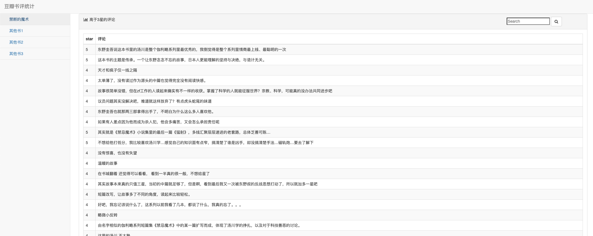

# week06 学习笔记
## 学习内容
1. Django安装部署运行流程
2. 从网页链接到页面呈现的整个流程
3. Django的MTV
4. urls调度器匹配方式
5. ORM来操作数据表的方式，以及ORM类与数据表的转换
6. 将变量带入模板的方式
7. Django的manage.py源码学习
8. Python 模块和包
### 作业说明
网页链接：127.0.0.1:8000/douban
支持短评关键词搜索展示 
网页效果：

